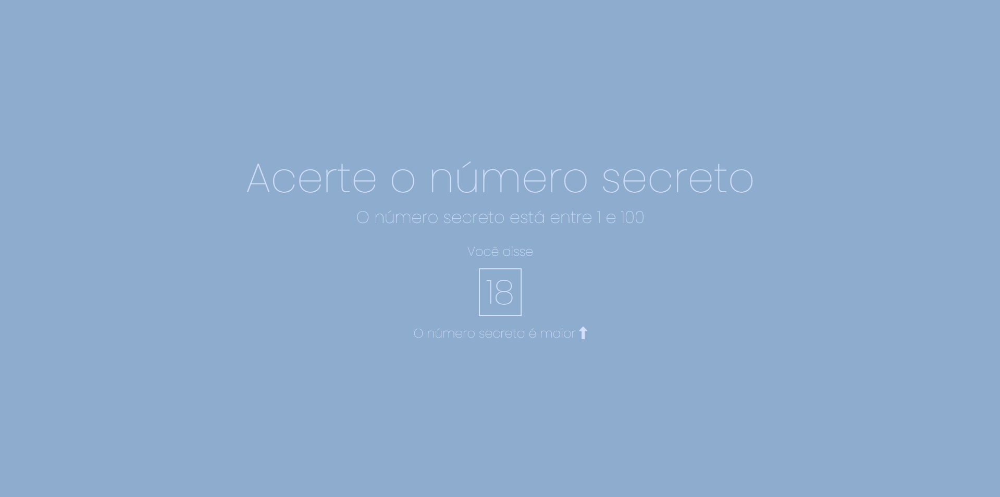

## Visão Geral

### O projeto

- Criar um jogo de adivinhar o número, porém utilizando o microfone para os chutes.

### Screenshot

### Links

- Live Site URL: [Número Secreto](https://numero-secreto-comando-de-voz.vercel.app/)

## Meu processo

### Criado com

- HTML
- CSS
- JavaScript

### O que eu aprendi

- Aprendi a utilizar SpeechRecognition()

## Autor

- GitHub - [João Metzdorf](https://github.com/joaometzdorf)
